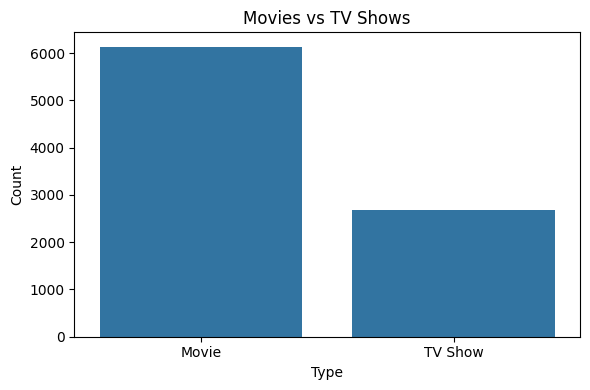
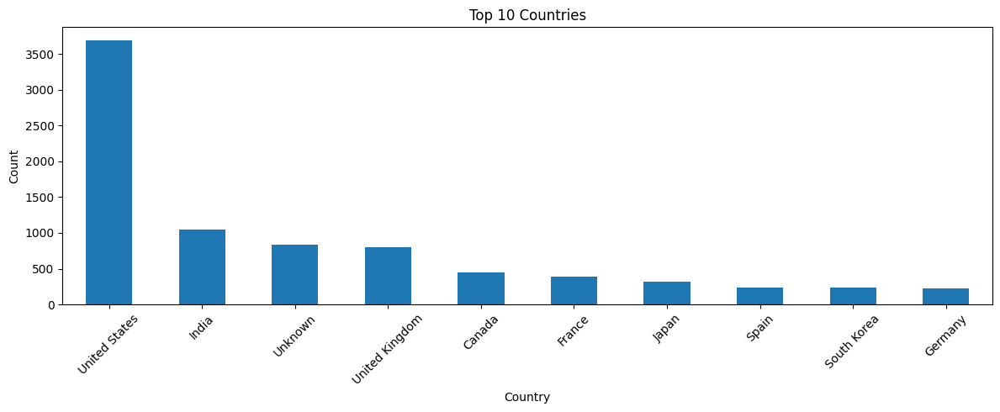
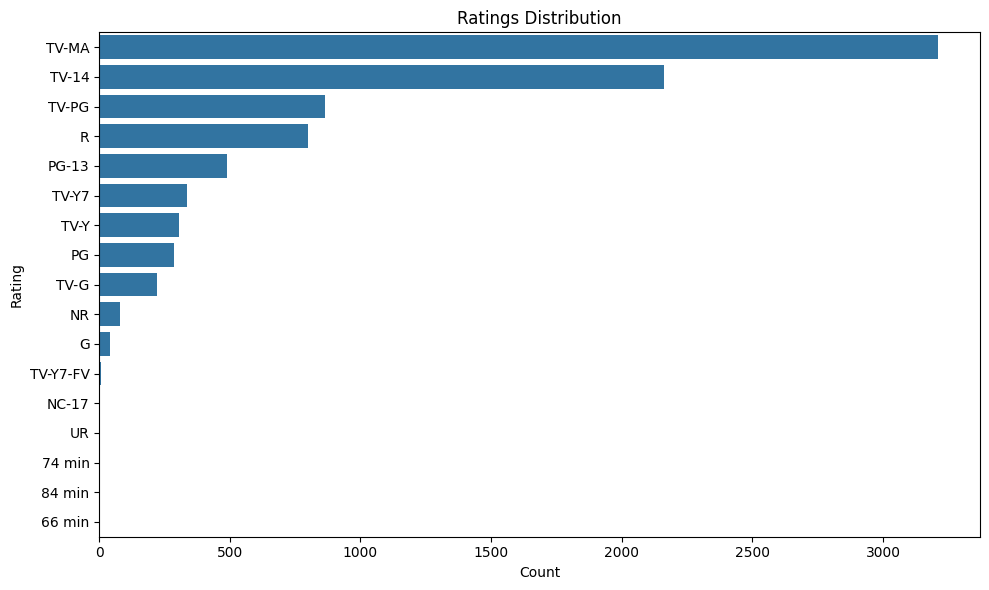
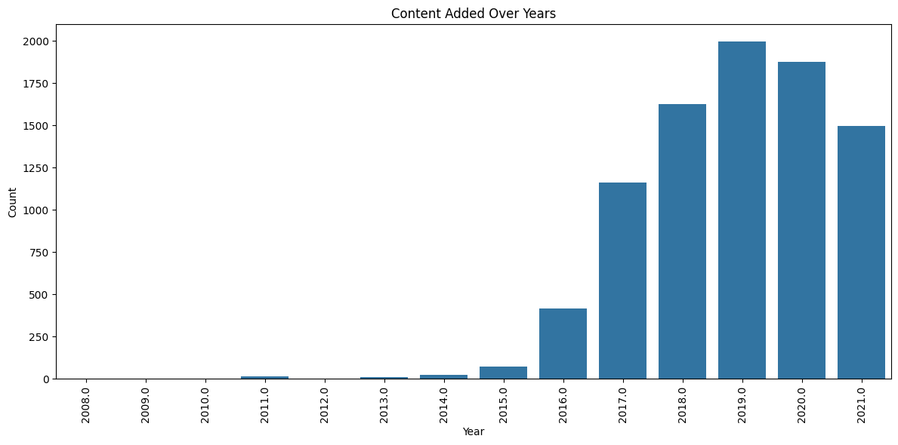
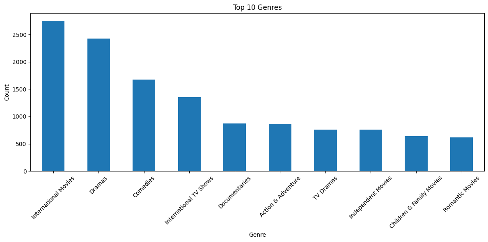

# Netflix EDA Project

## Overview

This project performs Exploratory Data Analysis (EDA) on the Netflix Movies and TV Shows dataset using Python.  
The analysis focuses on understanding content distribution, genre popularity, ratings, top content-producing countries, and yearly growth trends of Netflix content.

---

## Technologies Used

- Python
- Pandas
- Matplotlib
- Seaborn
- VS Code
- Git & GitHub

---

## Workflow

1. Data Collection
2. Data Cleaning
3. Exploratory Data Analysis (EDA)
4. Data Visualization
5. Insights Extraction

---

## Features

- Missing value handling
- Duplicate removal
- Movies vs TV Shows analysis
- Country-wise content analysis
- Ratings distribution analysis
- Genre analysis
- Content added over years visualization
- Automatic graph image saving

---

## Key Insights

- Netflix contains significantly more Movies than TV Shows.
- The United States contributes the highest number of titles on Netflix.
- Drama, International Movies, and Comedy are among the most popular genres.
- Netflix experienced rapid content growth after 2015.
- TV-MA is one of the most frequently occurring content ratings.
- Content production increased steadily over the years, showing Netflix’s expanding global reach.

---

## Visualizations

### Movies vs TV Shows

### Top Countries

### Ratings Distribution

### Content Added Over Years

### Top Genres

---

## Files

- netflix_eda.py
- netflix_titles.csv
- README.md
- requirements.txt
- images/

---

## Conclusion

This project demonstrates how Exploratory Data Analysis can be used to understand trends and patterns in Netflix content.  
Using Python visualization libraries, meaningful insights were extracted regarding content types, genres, ratings, and yearly growth trends.

---

## Author

**Ranjith T**